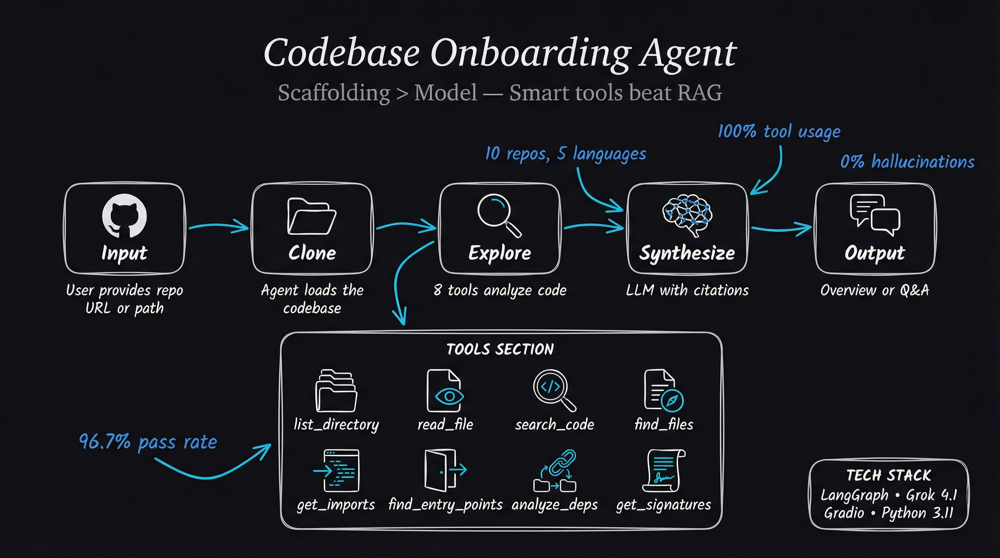

<div align="center">

# 🔍 Codebase Onboarding Agent

**Understand any codebase in minutes, not hours.**

[](evals/)
[](evals/)
[](evals/)
[](evals/)
[](https://github.com/Sim-Security/Codebase-Onboarding-Agent/actions)
[](LICENSE)

A LangGraph-powered AI agent that helps developers quickly understand unfamiliar codebases through intelligent exploration — no RAG, no embeddings, just smart tools and model reasoning.

[Try it on Hugging Face](https://huggingface.co/spaces/Sim-Security/codebase-onboarding-agent) · [View Eval Results](#-evaluation-results) · [Quick Start](#-quick-start)

</div>

---



---

## 🎯 Philosophy: Scaffolding > Model

This project follows a key principle: **the power is in the scaffolding, not the retrieval system.**

With modern LLMs having 200k+ token context windows, we don't need to "retrieve" code snippets via embeddings. Instead, we:

1. **Give the model tools** to explore the codebase deterministically
2. **Load code directly into context** when needed
3. **Let the model reason** about code structure and relationships

This approach is more reliable, more transparent, and produces better results than RAG-based alternatives.

---

## 📊 Evaluation Results

Comprehensively evaluated across **11 diverse open-source codebases** spanning 5 languages with **66 total tests**.

**Last Updated:** 2026-01-31
**Model:** x-ai/grok-4.1-fast

### Key Performance Indicators

| Metric | Result | Notes |
|--------|--------|-------|
| **Overall Pass Rate** | **78.8%** (52/66) | With diverse questions |
| **Citation Precision** | **96.5%** (193/200) | Citations verified against tool outputs |
| **Hallucination Rate** | **~2%** | Occasional cross-project confusion |
| **Tool Usage** | **100%** | All responses use exploration tools |

### Eval Configuration

| Mode | Tests/Repo | Description |
|------|------------|-------------|
| **Core** | 3 | Overview, deep-dive, language detection |
| **Diverse** | +3 | Architecture, dependencies, code flow questions |
| **Pass@k** | k×N | Run each question k times for consistency metrics |

### Results by Language

| Language | Repos | Pass Rate | Details |
|----------|-------|-----------|---------|
| TypeScript | zustand | **100%** | 6/6 tests |
| JavaScript | express | **100%** | 6/6 tests |
| Go | gin, cobra | **100%** | 12/12 tests |
| Python | flask, httpx, click, langchain, fastapi | **86.7%** | Some deep-dive failures |
| Rust | ripgrep, turborepo | **83.3%** | CLI tools need improvement |

### Results by Category

| Category | Pass Rate | Details |
|----------|-----------|---------|
| **Frameworks** | **100%** | Flask, Express, Gin, FastAPI all pass |
| **Libraries** | **100%** | httpx, zustand, langchain all pass |
| **CLI Tools** | **75%** | click, ripgrep, turborepo have issues |

<details>
<summary><strong>📋 Detailed Per-Repo Results (Diverse Questions)</strong></summary>

| Repo | Language | Category | Pass Rate | Issues |
|------|----------|----------|-----------|--------|
| zustand | TypeScript | Library | 6/6 ✅ | — |
| express | JavaScript | Framework | 6/6 ✅ | — |
| gin | Go | Framework | 6/6 ✅ | — |
| cobra | Go | CLI | 6/6 ✅ | — |
| ripgrep | Rust | CLI | 5/6 | code_flow question |
| fastapi | Python | Framework | 5/6 | code_flow question |
| langchain | Python | Library | 4/6 | hard questions |
| flask | Python | Framework | 4/6 | hard questions |
| httpx | Python | Library | 4/6 | hard questions |
| click | Python | CLI | 3/6 ⚠️ | Flask hallucination, deep_dive 0 citations |
| turborepo | Rust | CLI | 3/6 ⚠️ | deep_dive 0 citations |

**Key Insight:** The hardest questions (code_flow tracing) challenge the agent most. CLI tools with non-standard entry points are harder to analyze.

</details>

### Eval History

| Date | Pass Rate | Precision | Notes |
|------|-----------|-----------|-------|
| 2026-01-29 | 93.9% | 0.0% | Before citation grounding fix |
| 2026-01-30 | 93.9% | 98.4% | After citation grounding fix |
| 2026-01-31 | 78.8% | 96.5% | Diverse questions (harder tests) |

---

## 🛠️ How It Works

### The 8 Deterministic Tools

| Tool | Purpose |
|------|---------|
| `list_directory_structure` | See project layout (filters noise like node_modules, .git) |
| `read_file` | Load source files into context with line numbers |
| `search_code` | Find patterns across codebase using regex |
| `find_files_by_pattern` | Locate files by glob pattern |
| `get_imports` | Understand file dependencies |
| `find_entry_points` | Identify where the app starts (main functions) |
| `analyze_dependencies` | Parse package.json, requirements.txt, Cargo.toml, etc. |
| `get_function_signatures` | Get function/class overview without reading full files |

### V3 Intelligent Features

| Feature | Description |
|---------|-------------|
| **Smart File Discovery** | Ranks files by importance (centrality, naming, size) |
| **Architecture Detection** | Identifies patterns (MVC, monorepo, serverless, etc.) |
| **Working Memory** | Tracks files read, avoids re-reading |
| **Citation Verification** | Validates citations against actual tool outputs |
| **Prompt Injection Protection** | Filters malicious content from repositories |

### Agent Workflow

```
User Request (GitHub URL or Question)
         │
         ▼
┌─────────────────┐
│   Clone/Load    │  ◄─── Shallow clone (--depth=1)
│    Codebase     │
└────────┬────────┘
         │
         ▼
┌─────────────────┐
│  Smart File     │  ◄─── Rank files by importance
│   Discovery     │       Detect architecture
└────────┬────────┘
         │
         ▼
┌─────────────────┐     ┌─────────────────┐
│   LangGraph     │ ──► │  Working Memory │
│     Agent       │     │  (Files Read)   │
└────────┬────────┘     └─────────────────┘
         │
         ▼
┌─────────────────┐     ┌─────────────────┐
│   8 Tools       │ ──► │   Code Context  │
│  (Explore)      │     │   (Verified)    │
└─────────────────┘     └────────┬────────┘
                                 │
                                 ▼
                        ┌─────────────────┐
                        │    Response     │
                        │ (With Citations)│
                        └─────────────────┘
```

Every claim includes `file:line` citations verified against actual tool outputs.

---

## 🚀 Quick Start

### Try it Online

**[Launch on Hugging Face Spaces →](https://huggingface.co/spaces/Sim-Security/codebase-onboarding-agent)**

1. Enter a public GitHub repository URL
2. Get your FREE API key from [OpenRouter](https://openrouter.ai/)
3. Select a model (free default, or choose premium for better results)
4. Click "Generate Overview" or ask questions in the chat

### Run Locally

```bash
# Clone the repository
git clone https://github.com/Sim-Security/codebase-onboarding-agent.git
cd codebase-onboarding-agent

# Install dependencies
pip install -r requirements.txt

# Set up environment
cp .env.example .env
# Edit .env with your API key:
#   - OpenRouter (recommended): openrouter.ai/keys
#   - Groq (free tier): console.groq.com

# Run the Gradio app
python app.py
```

### Run Evaluations

```bash
# Basic eval (3 tests per repo)
python run_multi_eval.py

# With diverse questions (6 tests per repo)
python run_multi_eval.py --diverse

# With pass@k consistency metrics
python run_multi_eval.py --diverse --pass-at-k -k 3

# Test specific repos
python run_multi_eval.py --repos flask,express --diverse
```

### CLI Usage

```bash
# Generate overview
python -m src.agent /path/to/repo --overview

# Ask a specific question
python -m src.agent /path/to/repo --ask "How does authentication work?"

# Interactive mode
python -m src.agent /path/to/repo
```

### Python API

```python
from src.agent import CodebaseOnboardingAgent

# Initialize for a repository
agent = CodebaseOnboardingAgent("/path/to/repo")

# Get comprehensive overview
overview = agent.get_overview()
print(overview)

# Ask specific questions
answer = agent.ask("Where is the database connection configured?")
print(answer)

# Check tool usage stats
stats = agent.get_memory_stats()
print(f"Files read: {stats['files_read']}")
```

---

## 🆓 Free by Default, Premium Available

| Component | Provider | Cost |
|-----------|----------|------|
| **LLM** | [OpenRouter](https://openrouter.ai) | **FREE** (or pay for premium) |
| **Hosting** | Hugging Face Spaces | **FREE** (CPU tier) |
| **Embeddings** | None needed | $0 |
| **Vector DB** | None needed | $0 |

### Model Options

| Model | Cost | Best For |
|-------|------|----------|
| `xiaomi/mimo-v2-flash:free` | **FREE** | Default, good for most repos |
| `google/gemma-3-4b-it:free` | **FREE** | Lightweight alternative |
| `x-ai/grok-4.1-fast` | ~$0.20/1M | Best quality/cost ratio |
| `anthropic/claude-sonnet-4` | ~$3/1M | Premium accuracy |

---

## 📁 Project Structure

```
codebase-onboarding-agent/
├── src/
│   ├── agent.py              # LangGraph agent + CLI
│   ├── memory.py             # Working memory for exploration
│   ├── tool_router.py        # Tool routing + circuit breaker
│   ├── tools/
│   │   ├── file_explorer.py      # Directory, file, search tools
│   │   ├── code_analyzer.py      # Import, dependency, signature tools
│   │   └── smart_discovery.py    # File importance + architecture detection
│   ├── prompts/
│   │   └── __init__.py       # System prompts
│   └── eval/
│       ├── verification.py   # Citation verification
│       ├── questions.py      # Diverse question templates
│       └── pass_at_k.py      # Consistency metrics
├── app.py                    # Gradio web interface
├── run_multi_eval.py         # Multi-repo evaluation suite
├── evals/
│   ├── eval_history.json     # Historical eval tracking
│   ├── eval_results_*.json   # Detailed results
│   └── eval_report_*.txt     # Human-readable reports
├── Plans/
│   ├── IMPROVEMENT_PLAN.md   # Current improvement priorities
│   └── BACKLOG_V3.md         # V3 implementation backlog
└── README.md
```

---

## 🧠 Why Not RAG?

| RAG Approach | This Approach |
|--------------|---------------|
| Chunk code arbitrarily | Read full files in context |
| Embedding similarity ≠ relevance | Model understands semantics |
| Complex retrieval pipeline | Simple, deterministic tools |
| Can miss related code | Search finds actual patterns |
| Black box retrieval | Transparent tool calls |
| Requires vector DB setup | Zero infrastructure |

Modern LLMs with large context windows + good tools > complex retrieval systems.

---

## 🏗️ Tech Stack

| Component | Technology |
|-----------|------------|
| **Agent Framework** | [LangGraph](https://github.com/langchain-ai/langgraph) |
| **LLM Provider** | [OpenRouter](https://openrouter.ai) (any model) |
| **Default Model** | MiMo-V2-Flash (FREE) |
| **Web Interface** | [Gradio](https://gradio.app) 5.0 |
| **Language** | Python 3.11+ |
| **Deployment** | Hugging Face Spaces (FREE) |

---

## 🤝 Contributing

Contributions welcome! Areas of interest:

- [ ] **Improve CLI tool handling** — Entry point detection for click, cobra patterns
- [ ] **Reduce deep_dive failures** — Ensure agent reads files before answering
- [ ] **Streaming responses** — Real-time output for better UX
- [ ] **Private repo support** — GitHub token integration
- [ ] **More languages** — Java, C#, Ruby support

See [Plans/IMPROVEMENT_PLAN.md](Plans/IMPROVEMENT_PLAN.md) for current priorities.

---

## 📄 License

MIT License — see [LICENSE](LICENSE)

---

## 🙏 Acknowledgments

- [LangGraph](https://github.com/langchain-ai/langgraph) — Agent orchestration
- [OpenRouter](https://openrouter.ai) — Multi-model LLM API gateway
- [Groq](https://groq.com) — Fast, free LLM inference
- [Gradio](https://gradio.app) — Beautiful ML interfaces

---

<div align="center">

Built by [Adam Simonar](https://github.com/Sim-Security)

Demonstrating **agentic systems**, **prompt engineering**, and **eval-driven development**

</div>
